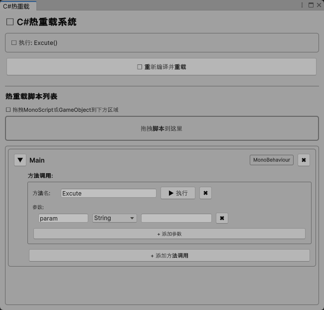

# Unity Runtime Hot Reload System

A lightweight Unity runtime hot reload system that allows you to modify and reload C# scripts without stopping Play mode. **Zero dependencies, ready to use!**

## ✨ Core Features

- 🔥 **Runtime Hot Reload**: Modify code while the game is running, no restart needed
- 🔄 **MonoBehaviour Auto-Replace**: Intelligently replace components on GameObjects
- 💾 **Complete State Preservation**: Automatically save and restore all field data during reload
- 🎯 **Visual Method Execution**: Execute methods directly from the editor, supports multiple parameter types
- 🛠️ **Zero Dependencies**: Uses .NET Framework's built-in CSharpCodeProvider, no third-party libraries needed
- 📝 **Drag-and-Drop Interface**: Simple and intuitive visual editor
- ⚡ **Lightweight**: No NuGet packages required, keeps your project clean

## 📋 System Requirements

- Unity 2022.3 or higher
- **API Compatibility Level must be set to .NET Framework**
- **No third-party libraries required!**

## 🚀 Quick Start

### 1. Import Hot Reload System

Copy the following files and folders to your Unity project:
- `Assets/Editor/HotReload/`
- `Assets/Scripts/Utils/HotReload/`

### 2. Configure API Compatibility Level

**Important**: In Unity menu:
1. Open `Edit > Project Settings > Player`
2. Expand `Other Settings`
3. Set `Api Compatibility Level` to `.NET Framework`

That's it! No third-party dependency packages to install. .NET Framework includes built-in `System.CodeDom.dll` support.

## 📖 Usage Tutorial

### Open Hot Reload Window

Menu: `Tools > C# Hot Reload Window`

### Add Scripts

1. Drag MonoScript or GameObject to the window
2. Scripts are automatically added to the hot reload list
3. Optional: Configure methods to execute

### Hot Reload Workflow

1. **Enter Play Mode**
2. **Modify Code** (add methods, change logic, etc.)
3. **Click "🔄 Recompile and Reload"**
4. **Takes Effect Immediately**!

The system will automatically:
- ✅ Compile new code
- ✅ Replace components on GameObjects
- ✅ Preserve all field data
- ✅ Make new methods immediately available

### Execute Methods

1. Click "+ Add Method Call" in script configuration
2. Enter method name
3. Add parameters (supports: String, Int, Float, Bool, Vector3)
4. Click "▶ Execute"

## ⚠️ Important Notes

### Debugging Limitations

**Hot-reloaded code cannot use breakpoints!**

Reasons:
- Debugger is attached to the original assembly
- Dynamically compiled code has no debug symbols
- Source code to runtime code mapping is lost

**Solutions**:
- When debugging is needed: Stop Play mode → Modify code → Run again
- For rapid iteration: Use hot reload

### C# Version Support

This system uses .NET Framework's built-in CSharpCodeProvider, supporting:
- ✅ All features of C# 7.3 and below
- ✅ Standard class, method, and property definitions
- ✅ Common features like LINQ, generics, delegates
- ⚠️ Does not support C# 8.0+ new features (like init accessors, record types, switch expressions, etc.)

For most Unity development scenarios, this is completely sufficient!

### MonoBehaviour Important Limitations

**⚠️ MonoBehaviour hot reload has known issues and is NOT recommended!**

Due to Unity's MonoBehaviour architecture limitations, hot reloading MonoBehaviour components encounters the following problems:
- ❌ Newly added methods may not be callable
- ❌ Component references are frequently lost
- ❌ GameObject references may become invalid after serialization
- ❌ Complex serialized data cannot be fully restored
- ❌ Component replacement is unstable

**💡 Strong Recommendations:**
- ✅ **Use traditional workflow for MonoBehaviour** (Stop Play mode → Modify code → Run again)
- ✅ **Hot reload system focuses on pure C# classes**, stable and reliable
- ✅ **Extract core logic into pure C# classes**, MonoBehaviour only for simple calls

## 🎯 Use Cases

### ✅ Highly Recommended: Pure C# Class Hot Reload

```csharp
// ✅ Perfect support! Hot reload works stable and reliable
public class GameLogic
{
    public int score;
    
    public void AddScore(int points)
    {
        score += points;
        Debug.Log($"Score: {score}");
    }
    
    // Can add new methods anytime, takes effect immediately!
    public void ResetScore()
    {
        score = 0;
    }
}
```

**Applicable Scenarios:**
- ✅ Game logic classes
- ✅ Data management classes
- ✅ Utility and helper classes
- ✅ Algorithm and calculation classes
- ✅ Rapid prototype validation
- ✅ Iterative development

### ⚠️ Not Recommended: MonoBehaviour Hot Reload

```csharp
// ⚠️ Not recommended for hot reload! Use traditional workflow
public class Player : MonoBehaviour
{
    // MonoBehaviour hot reload is unstable
    // Recommendation: Stop Play → Modify code → Run again
}
```

**Reasons:**
- ❌ Newly added methods may not be callable
- ❌ Component references are frequently lost
- ❌ Serialized data may be corrupted

### ❌ Not Suitable for Hot Reload

- Breakpoint debugging needed
- Complex bug investigation
- Performance profiling
- Production builds
- MonoBehaviour components

## 🔧 Technical Implementation

### Compiler

Uses .NET Framework's built-in `System.CodeDom.Compiler.CSharpCodeProvider`:
- ✅ No third-party dependencies
- ✅ Unity built-in support
- ✅ Stable and reliable
- ✅ Zero configuration

### Compilation Options

The system automatically configures the following compilation parameters:
```csharp
compilerParameters = new CompilerParameters
{
    GenerateExecutable = false,
    GenerateInMemory = true,
    IncludeDebugInformation = false
};
```

### Automatic Reference Management

The system automatically adds all necessary assembly references:
- .NET Framework core libraries
- Unity engine assemblies
- All loaded assemblies in the project

## 🐛 Known Issues

1. **Breakpoints unavailable** (design limitation)
2. **MonoBehaviour hot reload is unstable** (Unity architecture limitation, not recommended)
3. **C# 8.0+ features not supported** (compiler limitation)

**About MonoBehaviour:**
Due to the complexity of Unity's MonoBehaviour component system, hot reloading MonoBehaviour encounters various issues. We strongly recommend:
- Use traditional workflow for MonoBehaviour
- Extract core logic into pure C# classes
- Hot reload system focuses on rapid iteration of pure C# classes

## 🤝 Contributing

Pull Requests are welcome!

### Development Environment

1. Fork this repository
2. Create feature branch: `git checkout -b feature/AmazingFeature`
3. Commit changes: `git commit -m 'Add some AmazingFeature'`
4. Push branch: `git push origin feature/AmazingFeature`
5. Submit Pull Request

## 📄 License

This project is licensed under the **MIT License**.

This means you can:
- ✅ Commercial use
- ✅ Modify code
- ✅ Distribute
- ✅ Private use

See [LICENSE](LICENSE) file for details.

## 🙏 Acknowledgments

- Microsoft .NET Framework - Providing powerful CodeDom compiler
- Unity Technologies - Excellent game engine

## 📞 Get Help

- 📧 Submit Issue: [GitHub Issues](https://github.com/yourusername/unity-hot-reload/issues)
- 💬 Discussions: [GitHub Discussions](https://github.com/yourusername/unity-hot-reload/discussions)

## 🗺️ Roadmap

- [x] Basic hot reload functionality
- [x] MonoBehaviour component replacement
- [x] Visual method execution
- [ ] Support more parameter types
- [ ] Improve error messages
- [ ] Add performance monitoring
- [ ] Support Assembly Definition

## 📊 Performance Notes

- Compilation time: Usually 1-2 seconds (depends on code complexity)
- Memory usage: About 1-3MB per hot-reloaded assembly
- Recommendation: Don't include too many scripts in one hot reload

## 💡 Best Practices

### 1. Code Organization (Important!)

```csharp
// ✅✅✅ Highly Recommended: Pure C# class - Perfect hot reload support
public class GameLogic
{
    private int score;
    
    public void UpdateScore(int points)
    {
        score += points;
    }
    
    // Can add new methods anytime, hot reload takes effect immediately!
    public int GetScore() => score;
}

// ❌❌❌ Not recommended for hot reload: MonoBehaviour - Use traditional workflow
public class Player : MonoBehaviour
{
    private GameLogic gameLogic = new GameLogic(); // Use pure C# class
    
    void Update()
    {
        // MonoBehaviour only for simple calls
        if (Input.GetKeyDown(KeyCode.Space))
        {
            gameLogic.UpdateScore(10); // Core logic in pure C# class
        }
    }
}
```

**Architecture Recommendations:**
- ✅ Extract game logic into pure C# classes
- ✅ MonoBehaviour only for Unity lifecycle and simple calls
- ✅ Hot reload focuses on rapid iteration of pure C# classes
- ❌ Don't hot reload MonoBehaviour components

### 2. Field Management

```csharp
// ✅ Simple types are automatically saved and restored
public int health;
public string playerName;

// ⚠️ Reference types may be lost
public GameObject target; // May be lost
public Player otherPlayer; // May be lost
```

### 3. Method Design

```csharp
// ✅ Recommended: Stateless methods
public int Calculate(int a, int b) 
{
    return a + b;
}

// ✅ Recommended: Explicit parameters
public void SetPosition(float x, float y, float z) { }
```

### 4. C# Version Compatibility

```csharp
// ✅ Supported (C# 7.3 and below)
public string Name { get; set; }
if (obj is Type t) { ... }
var result = (a > b) ? a : b;

// ❌ Not supported (C# 8.0+)
public string Name { get; init; }  // init accessor
var result = obj switch { ... };   // switch expression
record Person(string Name);        // record type
```

## 📸 Demo



## 🎓 Usage Examples

See [`CodeDomExample.cs`](Assets/Scripts/Utils/HotReload/CodeDomExample.cs) for detailed usage examples.

## 📝 Changelog

### v2.0.0 (2026-02-03)
- 🎉 Switched to CodeDom implementation
- ✨ Removed all third-party dependencies
- ✨ Zero configuration, ready to use
- ✨ More lightweight, more stable

### v1.0.0 (2026-02-02)
- 🎉 Initial release
- ✨ Runtime hot reload support
- ✨ MonoBehaviour auto-replacement
- ✨ Visual method execution interface

---

**Star ⭐ this project if it helps you!**